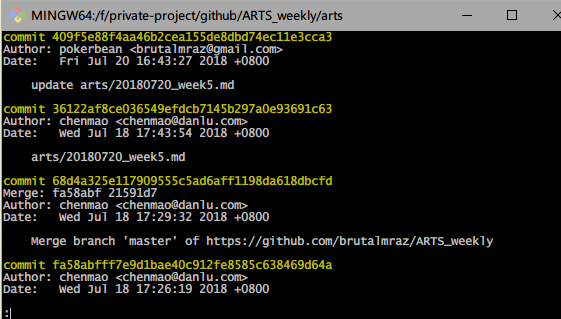

# 1.Algorithm

## Question:

Given a *m* x *n* matrix, if an element is 0, set its entire row and column to 0. Do it [**in-place**](https://en.wikipedia.org/wiki/In-place_algorithm).

**Example 1:**

```
Input: 
[
  [1,1,1],
  [1,0,1],
  [1,1,1]
]
Output: 
[
  [1,0,1],
  [0,0,0],
  [1,0,1]
]
```

**Example 2:**

```
Input: 
[
  [0,1,2,0],
  [3,4,5,2],
  [1,3,1,5]
]
Output: 
[
  [0,0,0,0],
  [0,4,5,0],
  [0,3,1,0]
]
```

**Follow up:**

- A straight forward solution using O(*m**n*) space is probably a bad idea.
- A simple improvement uses O(*m* + *n*) space, but still not the best solution.
- Could you devise a constant space solution?

## Solution 1:

```java
 public static   void setZeroes(int[][] matrix) {
        int m = matrix.length;
        int n = matrix[0].length;
        System.out.println(m +"*" +n);

        Set<Integer> row = new HashSet<>();
        Set<Integer> col = new HashSet<>();

        for (int i = 0; i <m ; i++) {
            for (int j = 0; j <n ; j++) {
                if (matrix[i][j]==0) {
                    row.add(i);
                    col.add(j);
                }
            }
        }
        for (Integer r : row) {
            for (int i = 0; i <n ; i++) {
                matrix[r][i] = 0 ;
            }
        }

        for (Integer c : col) {
            for (int i = 0; i <m ; i++) {
                matrix[i][c] = 0 ;
            }
        }
       

    }
```


## Solution 2:

```java
   public static  void setZeroes2(int[][] matrix) {
        int m = matrix.length;
        int n = matrix[0].length;

        boolean [] row = new boolean[m];
        boolean [] col = new boolean[n];
        for (int i = 0; i <m ; i++) {
            for (int j = 0; j <n ; j++) {
                if (matrix[i][j]==0) {
                    row[i]=true;
                    col[j] =true;
                }
            }
        }
        for (int j = 0; j < row.length; j++) {
            if (row[j]) {
                for (int i = 0; i <n ; i++) {
                    matrix[j][i] = 0 ;
                }
            }

        }
        for (int j = 0; j < col.length; j++) {
            if (col[j]) {
                for (int i = 0; i <m ; i++) {
                    matrix[i][j] = 0 ;
                }
            }
        }
    }
```


# 2.Review

[**The U.S. Immigration System Is Broken and Inhumane**](https://medium.com/@sethmoulton/the-border-c89483e5bc7b)


# 3.Tip

本周分享一些Git日常工作中比较常用的一些操作


##  一、同时管理多个远程仓库

在使用Git的过程中， 有时候我们需要将本地分支代码同步到不同的远端仓库中。

那么如何使用Git管理多个远程仓库呢:

假设我们有两个远端仓库 「repo1」「repo2」

#### 	1.同一个remote 配置多个url

 如果是两个仓库都是空的，就直接在 .git/config 中添加远端地址

```
[remote "origin"]
    url = https://github.com/username/repo1.git
    url = https://git.coding.net/username/repo2.git  #添加新地址
    fetch = +refs/heads/*:refs/remotes/origin/*
```

 由于两个仓库都是空的， 如果都使用同一个分支如master，同步起来没有问题的。如果分支有差异，同步起来就会有各种问题。

####  	2.配置多个remote仓库

假设Github中已有代码，若要在Coding里备份一个，并且两边仓库同步到一致的状态。

先到Coding新建仓库，获得地址后， .git/config 中添加Coding的远端地址，命名为coding：

```
[remote "origin"]
    url = https://github.com/username/repo1.git
    fetch = +refs/heads/*:refs/remotes/origin/*
[remote "coding"]   #添加coding远端
    url = https://git.coding.net/username/repo2.git  #远端地址
    fetch = +refs/heads/*:refs/remotes/coding/*  #修改远端
```

配置完成后， 我们在Push代码的时候就可以选择任一远端仓库进行推送同步

同时管理多个远程仓库这种情况 主要还是因为自己的个人项目，想要在多个远程平台上进行同步， 分支也比较简单一致，所以管理起来还是比较方便。  

但在工作中还是应该遵循团队的Git分支管理规范，个人觉得 原则上尽量不要使用这种方式进行管理，一个远端仓库对应一个本地仓库，以免造成不必要的混乱。

​	

### 二、Git 删除分支上某次提交记录， 并同步到远端。

1、首先执行	

```
git log
```

 	 

2 .   选择出你需要删除的commit  对应的commitId

​	然后执行

```
git rebase -i "commit id"^
```

（”commit id”替换为想要删除的提交的”commit id”，^表示意思是commit id的前一次提交） 


删除掉 你想要删的commitId 对应的所有行，

然后保存 ： wq

然后强制推送到远端  

```
 git push origin master -f
```

这样， 远端仓库对应的提交记录也删除了。

执行git log  此时已无相应的记录。


# 4.Share

[康威定律——这个50年前就被提出的微服务概念，你知多少？](http://blog.didispace.com/%E5%BA%B7%E5%A8%81%E5%AE%9A%E5%BE%8B%E2%80%94%E2%80%94%E8%BF%99%E4%B8%AA50%E5%B9%B4%E5%89%8D%E5%B0%B1%E8%A2%AB%E6%8F%90%E5%87%BA%E7%9A%84%E5%BE%AE%E6%9C%8D%E5%8A%A1%E6%A6%82%E5%BF%B5%EF%BC%8C%E4%BD%A0%E7%9F%A5%E5%A4%9A%E5%B0%91%EF%BC%9F/)


