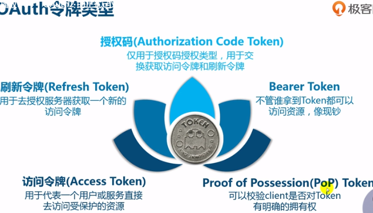
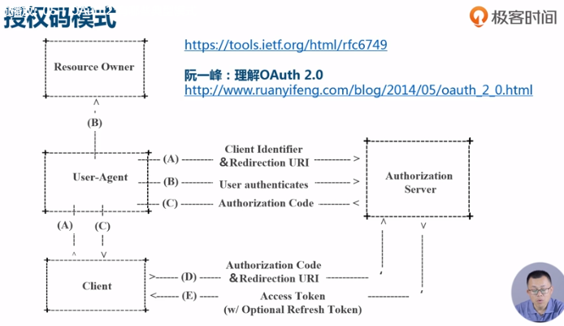
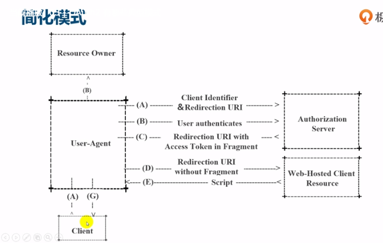
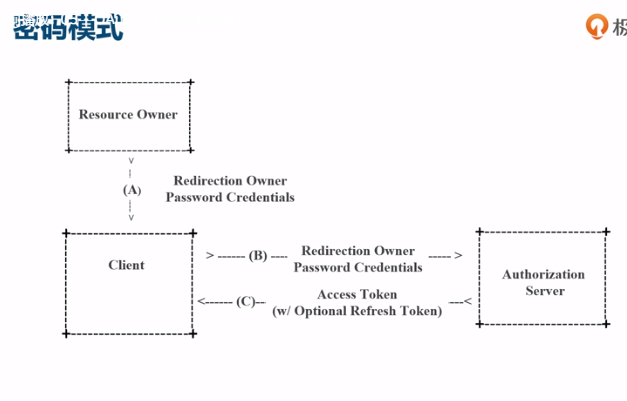
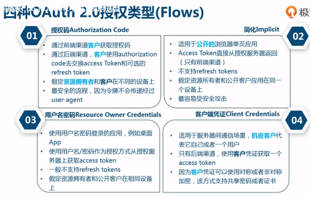
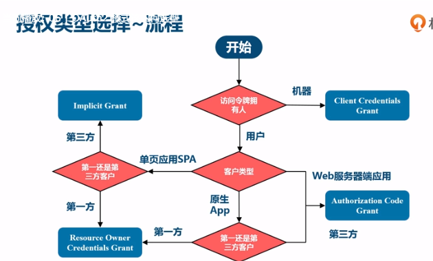

# 概述

## 资源访问安全方案演进:

### 1.用户名密码复制

### 2.万能钥匙

### 3.特殊令牌

# OAuth2正式定义

是授权框架， 不是认证协议， 仅用于授权代理。

如果拿到token之后，岂不是对于任何服务的访问就没有限制了，利用该token攻击别人的数据怎么处理呢

** 回复

不是，资源服务器会对token进行权限校验（也可在微服务网关上集中做），简单讲，资源服务器可以按需增加细粒度权限控制～这个token对应的用户是什么角色，有什么权限，能做什么操作，资源服务器有更多决策权，而且不同资源服务器可有不用策略。当然token是有被盗用风险，有一些安全措施防止被盗，发现被盗可以吊销，另外可根据场景缩短token有效期。

# OAuth2典型模式

## 1.授权码模式

## 2.简化模式  (比较适用单页应用)

## 3.密码模式  （适用企业内部）

## 4.客户端模式（机器对机器）

# OAuth2 模式选型

